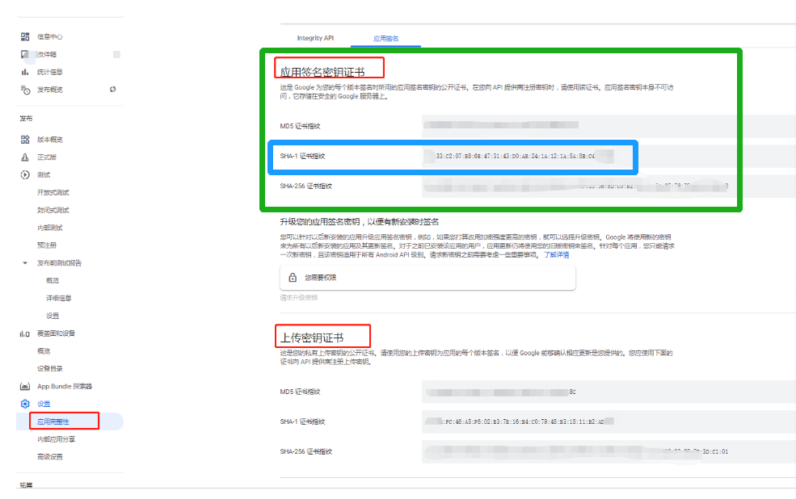

# Facebook SDK for Android key hash

[Android 版 Facebook SDK 入门指南](https://developers.facebook.com/docs/android/getting-started/) 中要求开发者提供秘钥哈希。

这里有两种方式可以生成该秘钥哈希，分别用于不同的情况：

1. 使用本地签名文件时：拥有签名文件和签名别名，使用 keytool
2. 使用 Google play 签名：拥有签名文件 SHA-1 指纹，使用此 Python 脚本。

## keytool

```shell
keytool -exportcert -alias androiddebugkey -keystore ~/.android/debug.keystore | openssl sha1 -binary | openssl base64
```

输入示例: `6CLCkdNPeQT6hkcLUqYI8fKVg6k=`

- alias: Android 签名文件的别名
- keystore: Android 签名文件路径

## Python 脚本

```shell
python hash.py <SHA-1>
```

输入示例: `6CLCkdNPeQT6hkcLUqYI8fKVg6k=`

SHA-1 可以从 Google Play Console 上获取，请参考下面截图的蓝色区域


